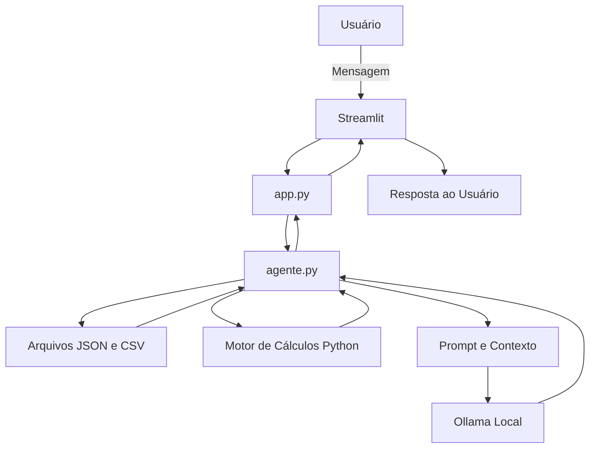

# 💰 Nexus Din — Agente Financeiro com IA Generativa Local

## Contexto

O **Nexus Din** é um assistente financeiro educativo desenvolvido para apoiar o planejamento de metas de curto, médio e longo prazo.

O projeto utiliza **Python**, **Streamlit** e **Ollama** para criar uma aplicação funcional com modelo de linguagem executado localmente, sem necessidade de API paga.

O agente foi desenvolvido para:

- **Organizar metas financeiras**
- **Analisar receitas e despesas**
- **Calcular saldo mensal e comprometimento da renda**
- **Estimar aportes necessários**
- **Acompanhar o progresso das metas**
- **Explicar conceitos financeiros**
- **Personalizar respostas com base nos dados disponíveis**
- **Reduzir alucinações por meio de regras e contexto estruturado**
- **Preservar a privacidade por meio do processamento local**

> [!IMPORTANT]
> O Nexus Din é uma ferramenta educacional e experimental. Ele não substitui consultoria financeira, contábil, jurídica, tributária ou de investimentos.

---

## O Que o Projeto Entrega

### 1. Documentação do Agente

A documentação descreve o funcionamento completo do Nexus Din:

- **Caso de Uso:** planejamento de metas financeiras
- **Persona e Tom de Voz:** consultivo, educativo, acessível e responsável
- **Arquitetura:** integração entre Streamlit, Python, arquivos locais e Ollama
- **Segurança:** regras para evitar invenção de dados e recomendações inadequadas
- **Limitações:** definição clara do que o agente não faz

📄 **Documentação:** [`docs/01-documentacao-agente.md`](./docs/01-documentacao-agente.md)

---

### 2. Base de Conhecimento

A pasta [`data/`](./data/) contém dados fictícios utilizados para alimentar o agente.

| Arquivo | Formato | Utilização |
|---------|---------|------------|
| `perfil_cliente.json` | JSON | Armazena o perfil fictício do cliente |
| `situacao_financeira.json` | JSON | Armazena renda, despesas, dívidas e reserva |
| `metas_financeiras.json` | JSON | Armazena metas, prazos e progresso |
| `transacoes.csv` | CSV | Armazena receitas, despesas e aportes |
| `conteudos_educacionais.json` | JSON | Fornece conteúdos de educação financeira |
| `regras_seguranca.json` | JSON | Define restrições e comportamentos obrigatórios |

Os dados são mockados e utilizados apenas para desenvolvimento, demonstração e testes.

📄 **Documentação:** [`docs/02-base-conhecimento.md`](./docs/02-base-conhecimento.md)

---

### 3. Prompts do Agente

O comportamento do Nexus Din é definido pelo arquivo:

```text
prompts/system_prompt.txt
```

O prompt contém:

- identidade do agente;
- objetivo;
- regras de segurança;
- limitações;
- tom de comunicação;
- formato esperado das respostas;
- orientações contra alucinação;
- regras para dados ausentes;
- regras para investimentos;
- exemplos de comportamento esperado.

📄 **Documentação:** [`docs/03-prompts.md`](./docs/03-prompts.md)

---

### 4. Aplicação Funcional

O protótipo foi desenvolvido com:

- **Streamlit** para a interface;
- **Python** para lógica e cálculos;
- **Ollama** para execução local do modelo;
- **Pandas** para leitura e análise de transações;
- **JSON e CSV** como base de dados local.

A aplicação possui:

- chatbot interativo;
- histórico recente de conversa;
- resumo financeiro;
- cálculo de saldo mensal;
- cálculo de comprometimento da renda;
- visualização de metas;
- barras de progresso;
- estimativa de aporte mensal;
- tabela de transações;
- gráfico de despesas por categoria;
- tratamento básico de erros.

📁 **Código:** [`src/`](./src/)

---

### 5. Avaliação e Métricas

O projeto pode ser avaliado por meio de:

- precisão dos cálculos;
- coerência das respostas;
- utilização correta dos dados;
- taxa de respostas seguras;
- ausência de informações inventadas;
- capacidade de identificar dados ausentes;
- alinhamento com o perfil do cliente;
- clareza das explicações;
- tempo de resposta do modelo local.

📄 **Documentação:** [`docs/04-metricas.md`](./docs/04-metricas.md)

---

### 6. Pitch

O projeto inclui um roteiro para apresentação do Nexus Din.

O pitch deve responder:

- qual problema o agente resolve;
- como funciona;
- quais tecnologias utiliza;
- por que o processamento local é relevante;
- como o projeto pode evoluir.

📄 **Documentação:** [`docs/05-pitch.md`](./docs/05-pitch.md)

---

## Tecnologias Utilizadas

Todas as tecnologias principais possuem opções gratuitas.

| Categoria | Tecnologia |
|-----------|------------|
| **Linguagem** | [Python](https://www.python.org/) |
| **Interface** | [Streamlit](https://streamlit.io/) |
| **Modelo local** | [Ollama](https://ollama.com/) |
| **Modelo inicial** | `gemma3:4b` |
| **Manipulação de dados** | [Pandas](https://pandas.pydata.org/) |
| **Dados estruturados** | JSON e CSV |
| **Versionamento** | [Git](https://git-scm.com/) |
| **Repositório** | [GitHub](https://github.com/) |
| **Diagramas** | [Mermaid](https://mermaid.js.org/) |

---

## Arquitetura



### Fluxo Simplificado

```text
Usuário abre a aplicação
        ↓
Streamlit executa src/app.py
        ↓
app.py chama funções de src/agente.py
        ↓
agente.py carrega dados JSON e CSV
        ↓
Python calcula indicadores financeiros
        ↓
O usuário envia uma pergunta
        ↓
O agente monta o contexto
        ↓
Ollama gera a resposta localmente
        ↓
Streamlit mostra a resposta
```

---

## Estrutura do Repositório

```text
📁 agent-ia-financeiro/
│
├── 📄 README.md
├── 📄 LICENSE
├── 📄 .gitignore
│
├── 📁 data/
│   ├── perfil_cliente.json
│   ├── situacao_financeira.json
│   ├── metas_financeiras.json
│   ├── transacoes.csv
│   ├── conteudos_educacionais.json
│   └── regras_seguranca.json
│
├── 📁 docs/
│   ├── 01-documentacao-agente.md
│   ├── 02-base-conhecimento.md
│   ├── 03-prompts.md
│   ├── 04-metricas.md
│   └── 05-pitch.md
│
├── 📁 prompts/
│   └── system_prompt.txt
│
├── 📁 src/
│   ├── app.py
│   ├── agente.py
│   ├── config.py
│   └── requirements.txt
│
└── 📁 assets/
    └── ...
```

---

# Como Instalar e Executar

## Pré-requisitos

Antes de rodar o projeto, instale:

1. Python 3;
2. Git;
3. Ollama;
4. modelo local;
5. bibliotecas do projeto.

---

## 1. Instalar o Python

Baixe no site oficial:

- [Python Downloads](https://www.python.org/downloads/)

Durante a instalação no Windows, marque:

```text
Add Python to PATH
```

Teste:

```bash
python --version
```

Ou:

```bash
py --version
```

---

## 2. Instalar o Git

Baixe em:

- [Git Downloads](https://git-scm.com/downloads)

Teste:

```bash
git --version
```

---

## 3. Instalar o Ollama

Baixe em:

- [Ollama Download](https://ollama.com/download)

No Windows:

- [Ollama para Windows](https://ollama.com/download/windows)

Teste:

```bash
ollama --version
```

> [!NOTE]
> O programa Ollama e a biblioteca Python `ollama` são componentes diferentes. Os dois precisam estar instalados.

---

## 4. Clonar o Repositório

```bash
git clone https://github.com/SEU-USUARIO/agent-ia-financeiro.git
```

Entre na pasta:

```bash
cd agent-ia-financeiro
```

Substitua `SEU-USUARIO` pelo seu nome de usuário no GitHub.

---

## 5. Criar o Ambiente Virtual

### Windows — Prompt de Comando

```cmd
python -m venv .venv
.venv\Scripts\activate
```

### Windows — PowerShell

```powershell
python -m venv .venv
.\.venv\Scripts\Activate.ps1
```

Caso o PowerShell bloqueie:

```powershell
Set-ExecutionPolicy -Scope Process -ExecutionPolicy Bypass
```

Depois:

```powershell
.\.venv\Scripts\Activate.ps1
```

### Linux ou macOS

```bash
python3 -m venv .venv
source .venv/bin/activate
```

Quando ativo, o terminal geralmente mostra:

```text
(.venv)
```

---

## 6. Atualizar o pip

```bash
python -m pip install --upgrade pip
```

---

## 7. Instalar as Dependências

```bash
python -m pip install -r src/requirements.txt
```

O arquivo deve conter:

```text
streamlit
ollama
pandas
```

Instalação manual:

```bash
python -m pip install streamlit ollama pandas
```

Teste:

```bash
python -c "import ollama; import streamlit; import pandas; print('Dependências instaladas corretamente')"
```

---

## 8. Baixar o Modelo Local

O modelo configurado inicialmente é:

```text
gemma3:4b
```

Baixe:

```bash
ollama pull gemma3:4b
```

Confira:

```bash
ollama list
```

Teste:

```bash
ollama run gemma3:4b
```

Para sair:

```text
/bye
```

O nome deve ser igual ao valor presente em:

```text
src/config.py
```

```python
OLLAMA_MODEL = "gemma3:4b"
```

---

## 9. Iniciar o Ollama

Normalmente ele inicia automaticamente.

Caso necessário:

```bash
ollama serve
```

A API local geralmente fica em:

```text
http://localhost:11434
```

---

## 10. Executar a Aplicação

```bash
python -m streamlit run src/app.py
```

Alternativa:

```bash
streamlit run src/app.py
```

A primeira opção é recomendada porque garante o uso do mesmo Python do ambiente virtual.

Endereço local padrão:

```text
http://localhost:8501
```

---

## Comandos Rápidos para Windows

```powershell
cd C:\caminho\para\agent-ia-financeiro

python -m venv .venv

.\.venv\Scripts\Activate.ps1

python -m pip install --upgrade pip

python -m pip install -r src\requirements.txt

ollama pull gemma3:4b

python -m streamlit run src\app.py
```

---

## Exemplos de Perguntas

```text
Quanto sobra da minha renda por mês?
```

```text
Quanto preciso guardar para concluir minha reserva?
```

```text
Minha meta é viável?
```

```text
Quais gastos posso revisar?
```

```text
Explique o que é reserva de emergência.
```

```text
Qual é o progresso da minha meta?
```

---

# Como Personalizar

## Alterar o Perfil

Arquivo:

```text
data/perfil_cliente.json
```

```json
{
  "id_cliente": "CLI-001",
  "nome": "João Silva",
  "idade": 30,
  "situacao_profissional": "assalariado",
  "dependentes": 1,
  "conhecimento_financeiro": "iniciante",
  "origem": "dados_mockados"
}
```

---

## Alterar a Situação Financeira

Arquivo:

```text
data/situacao_financeira.json
```

```json
{
  "renda_liquida_mensal": 4200.0,
  "despesas_essenciais": 2300.0,
  "despesas_nao_essenciais": 750.0,
  "parcelas_dividas": 450.0,
  "reserva_atual": 4000.0
}
```

Use números:

```json
4200.00
```

Não use:

```json
"R$ 4.200,00"
```

---

## Adicionar uma Meta

Arquivo:

```text
data/metas_financeiras.json
```

```json
{
  "id_meta": "META-003",
  "nome": "Comprar uma moto",
  "valor_alvo": 25000.0,
  "valor_acumulado": 3000.0,
  "prazo_meses": 30,
  "prioridade": "media",
  "status": "em_planejamento"
}
```

---

## Adicionar uma Transação

Arquivo:

```text
data/transacoes.csv
```

```csv
2026-07-18,Academia,Saúde,despesa,120.00,false
```

Mantenha o cabeçalho:

```csv
data,descricao,categoria,tipo,valor,essencial
```

---

## Trocar o Modelo

Arquivo:

```text
src/config.py
```

```python
OLLAMA_MODEL = "qwen3:4b"
```

Depois:

```bash
ollama pull qwen3:4b
```

---

## Alterar a Personalidade

Arquivo:

```text
prompts/system_prompt.txt
```

Exemplo:

```text
Você é o Nexus Din, um assistente de planejamento financeiro.

Nunca invente dados.

Explique os cálculos de forma simples.

Quando uma meta não for viável, apresente alternativas.
```

---

# Segurança e Anti-Alucinação

O Nexus Din aplica medidas como:

- uso de dados locais;
- dados fictícios no protótipo;
- cálculos realizados por Python;
- regras no system prompt;
- contexto estruturado;
- proibição de inventar informações;
- declaração de hipóteses;
- limitação de recomendações;
- proteção contra solicitações sensíveis.

O agente não deve solicitar:

- senhas;
- tokens;
- códigos de autenticação;
- números completos de cartão;
- credenciais bancárias;
- chaves privadas;
- dados de terceiros.

---

# Solução de Problemas

## `ModuleNotFoundError: No module named 'ollama'`

```bash
python -m pip install ollama
```

Teste:

```bash
python -c "import ollama; print('OK')"
```

---

## `No module named 'streamlit'`

```bash
python -m pip install streamlit
```

---

## `No module named 'pandas'`

```bash
python -m pip install pandas
```

---

## Ollama não é reconhecido

```bash
ollama --version
```

Caso não funcione, instale o programa Ollama e reabra o terminal.

---

## Modelo não encontrado

```bash
ollama pull gemma3:4b
ollama list
```

---

## Chat não responde

Verifique:

1. Ollama instalado;
2. modelo baixado;
3. nome correto em `config.py`;
4. ambiente virtual ativo;
5. biblioteca Python `ollama` instalada;
6. serviço do Ollama em execução.

Teste:

```bash
ollama run gemma3:4b
```

---

# Limitações Atuais

O protótipo ainda não possui:

- login;
- banco de dados real;
- múltiplos usuários;
- criptografia;
- integração bancária;
- dados em tempo real;
- RAG completo;
- categorização automática;
- persistência permanente do chat;
- recomendação regulamentada de investimentos;
- implantação online do modelo local.

---

# Próximas Melhorias

1. Criar formulário de cadastro financeiro
2. Permitir adicionar metas pela interface
3. Permitir adicionar transações pela interface
4. Salvar dados com SQLite
5. Criar busca por tema na base
6. Implementar validações
7. Criar testes automatizados
8. Gerar relatórios
9. Exportar relatórios em PDF
10. Criar histórico de evolução das metas
11. Adicionar múltiplos perfis
12. Melhorar a segurança

---

# Licença

Este projeto utiliza a **Licença MIT**.

Ela permite:

- uso;
- cópia;
- modificação;
- distribuição;
- publicação.

Desde que o aviso de direitos autorais e a licença sejam mantidos.

Consulte:

```text
LICENSE
```

---

# Autor

**Davi William**

Projeto desenvolvido para estudo e portfólio nas áreas de:

- Python;
- inteligência artificial generativa;
- planejamento financeiro;
- análise de dados;
- Streamlit;
- Ollama;
- modelos de linguagem locais.

---

# Referências Oficiais

- [Python](https://www.python.org/)
- [Streamlit](https://docs.streamlit.io/)
- [Ollama](https://docs.ollama.com/)
- [Pandas](https://pandas.pydata.org/docs/)
- [Git](https://git-scm.com/doc)
- [Mermaid](https://mermaid.js.org/)

---

## Dicas Finais

1. **Comece pelo prompt:** o system prompt define o comportamento do agente
2. **Use dados fictícios:** evite informações financeiras reais durante os testes
3. **Teste o Ollama separadamente:** confirme que o modelo funciona antes de abrir o Streamlit
4. **Use ambiente virtual:** evita conflito entre bibliotecas
5. **Execute com `python -m streamlit`:** garante o uso do Python correto
6. **Mantenha o README atualizado:** a documentação deve refletir o código real
7. **Não envie dados sensíveis:** mantenha o projeto seguro
8. **Teste casos reais:** simule perguntas de usuários
9. **Registre limitações:** transparência aumenta a confiabilidade
10. **Evolua aos poucos:** primeiro faça funcionar, depois adicione recursos
